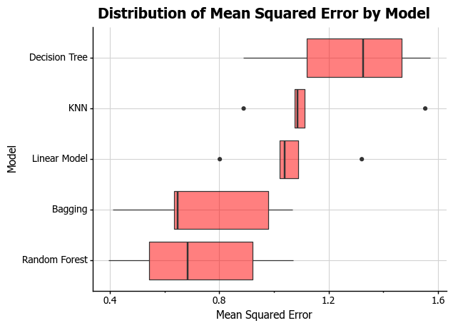

```{r setup, include=FALSE}
knitr::opts_chunk$set(echo = FALSE)
library(kableExtra)
library(dplyr)
```


```{r}
##<span style="text-decoration:underline"></span>
```

## Background {data-background="#F5F5F5"}

- As of December 1, 2020, there are <span style="color: red">**_13,714,024_**</span> confirmed COVID-19 cases and <span style="color: red">**_270,532_** </span> deaths in the United States
- Older adults and people with underlying medical conditions remain at increased risk 
- Other people who need extra precautions: racial and ethnic minority groups; people living in rural communities; people experiencing homelessness e.t.c..
- Data showing that some racial and ethnic minority groups are disproportionately affected by COVID-19

<div class="centered">
<span style="color: red">*__“Nationally, Black, Hispanic and Native American Cases And Deaths Exceed Their Share Of Population”__--Daniel Wood (NPR)*</span>
</div>

## Health Disparities {data-background=#F5F5F5}
- Differences in health outcomes between population groups closely linked to social,economic, and environmental disadvantage (*Healthy People 2020*)
- <span style="color: red">**Social determinants of health**</span> 
  - Access to educational, economic, job opportunities,
  - Health care access and quality
  - Housing and community design

``````{r, echo=FALSE, fig.align='center', out.width='50%'}
library(knitr)

```

<footer label="Source: CDC https://www.cdc.gov/publichealthgateway/sdoh/index.html"></footer>

## Methods/Approaches Considered {data-background=#F5F5F5}
- State-level COVID-19 cases and deaths (*The COVID Tracking Project*) and state-level data on legislative efforts to preserve or strengthen provisions of the Affordable Care Act (*HealthInsurance.org*)
- Outcome: 1=disparity; 0=no disparity
  - proportion of cases/deaths at least 33% higher than the Census Percentage of Population
  - proportion of cases/deaths elevated whether we include or exclude cases/deaths with unknown race/ethnicity.
  - proportion of cases/deaths based on at least 30 actual cases or deaths
- Features: 36 different measures 
- Modeling: Naive Bayes, K nearest neighbors, Decision Tree, Random Forest

  
## Methods/Approaches Used {data-background=#F5F5F5}
- NYT; ACS; County Ranking and Roadmaps; Bureau of Economic Analysis
- Outcome: constructed using NYT and ACS data


<div class="centered">
<span style="color: red">*__Outcome = % of COVID cases - % of Population__*</span>
</div>
```{r}
text_tbl <- data.frame(
  Value = c("> 0", "= 0", "< 0"),
  Description = c(
    "Given race/ethnic group experiencing disproportionately high percent of COVID-19 deaths relative to their percent of population ",
    "Given race/ethnic group' COVID-19 deaths are similar to their percent of the population", 
    "Given race/ethnic group' COVID-19 deaths are smaller than their percent of the population "
  )
)
kbl(text_tbl) %>%
  kable_paper(full_width = F) %>%
  column_spec(1, bold = T, border_right = T,width = "10em", background = "#F5F5F5") %>%
  column_spec(2, width = "20em")
```
<footer label="Source: CDC https://www.cdc.gov/nchs/nvss/vsrr/covid19/health_disparities.htm"></footer>
  
##  {data-background="#F5F5F5}
- Features: range from 27 to 42 and cover a range of county characteristics
  - Percentage of households that spend 50% or more of their household income on housing, 
  - Percentage of population who are low-income and do not live close to a grocery store, 
  - Percentage of population under age 65 without health insurance, 
- Modeling techniques
  - Linear Model
  - K-nearest neighbors
  - Bagging
  - Decision Tree
  - Random Forest

## Results  {data-background=#F5F5F5}
**Attempt 1** (27 features; 702 observations)

- Best model: Random Forest 
- Best score after tuning: 156.8

``````{r, echo=FALSE, fig.align='center', out.width='56%'}
library(knitr)

```

## {data-background=#F5F5F5}
**Attempt 2** (28 features and 663 observations) 

- Changed outcome and binned data (cases) 
- Best score after tuning Random Forest: 59.10

``````{r, echo=FALSE, fig.align='center', out.width='65%'}
library(knitr)

```

## {data-background=#F5F5F5}
**Attempt 3** (42 features and 701 observations)

- Pre-processing: logged a lot of right skewed data; binned data
- changed outcome variable 
- Best score after tuning Random Forest: 0.75

``````{r, echo=FALSE, fig.align='center', out.width='56%'}
library(knitr)

```


## Variable importance (50 shuffles)

<div class="centered">
*__Top five variables the model relied on most to make its predictions__*
</div>
```{r}
text_tbl <- data.frame(
  Attempt = c("Attempt 1", "Attempt 2", "Attempt 3"),
  Features = c(
    "Hispanic cases, Black cases, Severe Housing Burden, Uninsured Adults, Hispanic Population, and Black Population ",
    "Black cases, Black Population, Uninsured Adults, Severe Housing Burden, and White Cases", 
    "Black cases, Black Population, Food Insecurity, Uninsured, White Cases "
  )
)
kbl(text_tbl) %>%
  kable_paper(full_width = F) %>%
  column_spec(1, bold = T, border_right = T,width = "10em", background = "#F5F5F5") %>%
  column_spec(2, width = "20em")
```


## Plans to mitigate challenges

- Keep trying different version of outcome variable 
- Try imputing missing values 
- Consider correlation between variables
- Better features from the Social Vulnerability Index 

