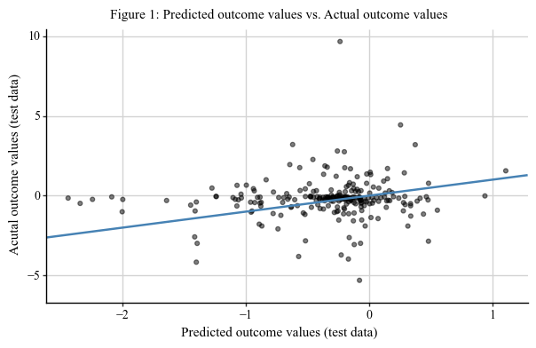
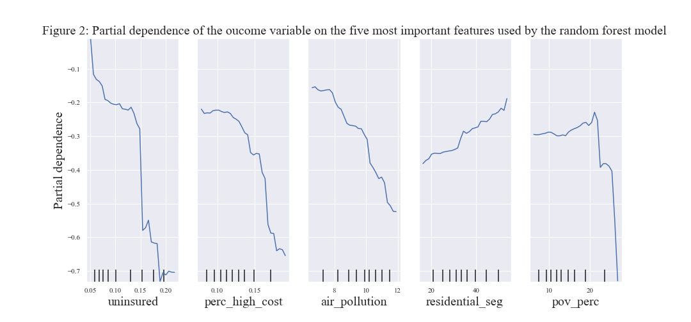
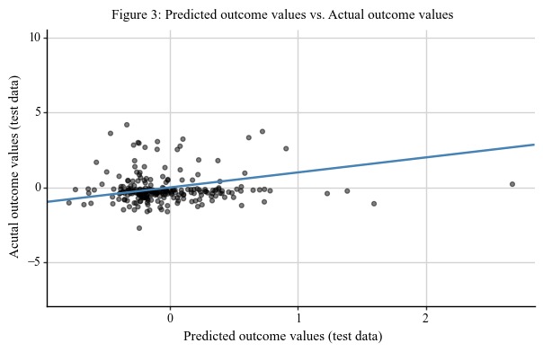
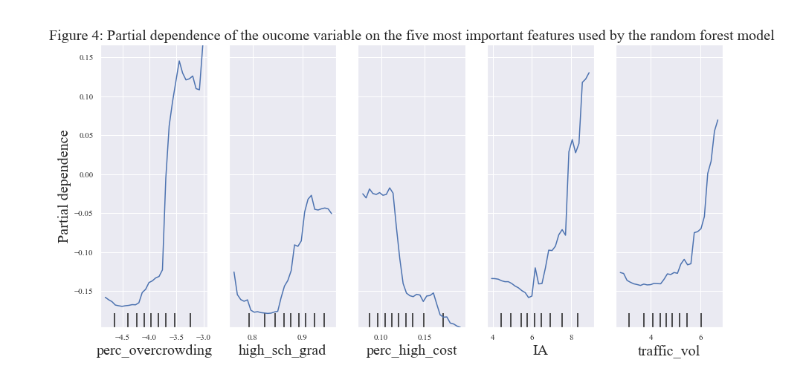
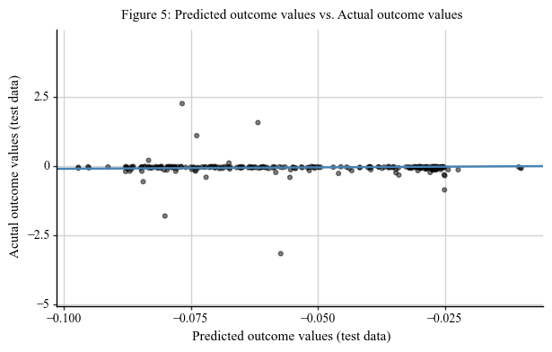
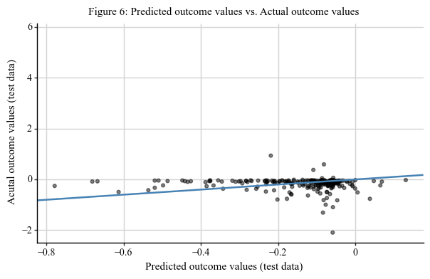
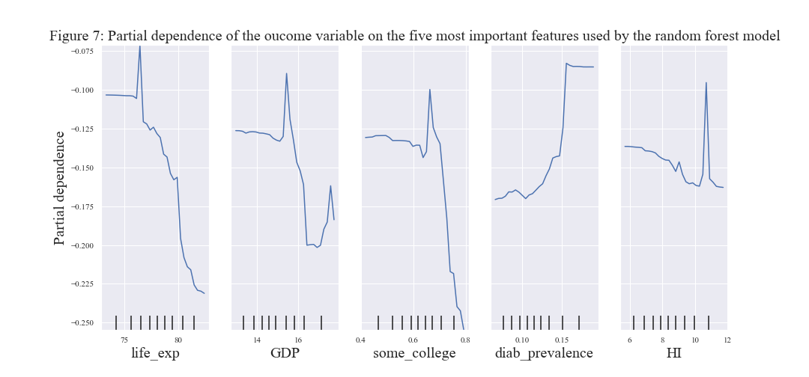

```{r, echo=FALSE, results='hide', message=FALSE, warning=FALSE}
library(knitr)
```
Word count (excluding title, byline, and references): 3000

### Introduction
The aim of this project is to explore predictors of COVID-19 health disparities. Using statistical learning tools, this project aims to predict the level of disparity among a county’s Black, Hispanic, Native American, and Asian American population. The variable being predicted measures if a specific race/ethnicity’s share of COVID-19 cases surpasses their share of the population. The variables being used to make this prediction consist of social, economic, and environmental characteristics of a county. This report provides a detailed description of the data sources, analysis process, and results.

### Problem Statement and Background
According to data collected and analyzed by The COVID Tracking Project at The Atlantic, “COVID-19 is affecting Black, Indigenous, Latinx, and other people of color the most” (1). Health disparities such as these are often tied to social determinants of health (i.e., non-medical factors in a person’s lived environment that affect health outcomes). For instance, in analysis of the number of deaths attributable to social factors in the United States, Galea et al. (2011) found that “approximately 245,000 deaths in the United States in 2000 were attributable to low education, 176,000 to racial segregation, 162,000 to low social support, 133,000 to individual-level poverty, 119,000 to income inequality, and 39,000 to area-level poverty (2).” Examining disparities through the framework of social determinants of health is particularly helpful to policymakers because it highlights institutional and policy failures that can be improved to achieve health equity and build resilient communities (3). The goal of this analysis is to use the framework of social determinants of health to explore predictors of COVID-19 disparities. 

### Data
The unit of observation for this project is state-county level. The data used in this project were obtained from a variety of sources. The data wrangling was primarily done using the pandas package in Python because it provides efficient tools to manipulate and merge disparate data sets (4). Below is a description of the data sources and the steps taken to clean and merge the datasets.

#### New York Times
The primary data source for this project is a New York Times (NYT) data set of county-level COVID-19 cases. After filing a Freedom of Information Act lawsuit against the CDC, the NYT was able to access nearly 1.5 million case records collected from March 2020 until May 2020 (5) . These records include county-level COVID-19 race and ethnicity data, which are the key variables of interest for this project, as they will be used to create the outcome variables. The NYT has made 974 of the case files (i.e,  974 county-level observations) publicly available in an excel spreadsheet via GitHub (6). The data was collected by directly downloading the excel file. The unit of observation in this dataset is already state-county level; as such, this will be the primary data on which all others will be merged onto. To prepare this data set for merging and analysis,  pandas’ ‘filter’ and ‘strip’ functions were used to isolate relevant variables (total cases; cases by race/ethnicity; fips code; state name; county name) and to remove leading zeros (7)(8). Additionally, the state names were converted to two-letter abbreviations using a publicly available converter (9). While missingness is not an issue in this data, the race/ethnicity break-downs of COVID-19 cases have quite a lot of zeroes. This will likely mean that these variables will be skewed; they will need to be logged to normalize their distribution prior to modeling.

#### United States Census Bureau
The U.S. Census Bureau provides a publicly available  excel spreadsheet of annual county resident population estimates by age, race, and hispanic origin for 2019 (10). This information was also obtained by downloading the excel sheet from the website. The variable of interest was race disaggregated population estimates for a county. Since this data provided race/ethnicity population estimates disaggregated by two genders (male and female), row-wise functions were used to sum the male and female population estimates for each race/ethnicity in a county. Additionally, the fips codes (unique state-county geographic identifiers) were not readily available as in the NYT dataset; panda’s ‘apply’ function was used to combine the state and county codes into a single column to create a fips code for each observation (11). 

County-level poverty rate and median household income for 2018 were obtained from the Bureau’s Small Area Income and Poverty Estimates (SAIPE) program (12). This data was missing state names (it only had state codes). To get more practice using python’s and pandas’ built-in functions, a dictionary of state codes and state names was created using information from the population data set from above. Among other things, this required using the ‘transpose’ function to reshape the data frame (13). The dictionary served as a state code converter (i.e., state code to full state name) that is similar to the publicly available converter used in the NYT data set. 

#### County Health Rankings and Roadmaps
The County Health Rankings and Roadmaps project is a collaborative program between the Robert Wood Johnson Foundation and the University of Wisconsin Population Health Institute (14). This program compiles a wide range of county-level metrics generated by federal agencies into a single excel spreadsheet. While the dataset contains over 700 variables, this project uses only 27 variables that characterize the socioeconomic, environmental, and health-related factors of a county. Some of the interesting variables incorporated in this project are: 

- The percentage of households that lack plumbing facilities
- Whether or not a county has a health-related drinking water violation
- The percentage of residents  who are low-income and do not live close to a grocery store.


Preparing this data for analysis and merging required using pandas ‘filter’ function to isolate the 27 variables selected for this project (7). Additionally, column titles were renamed using pandas ‘rename’ function (15). Lastly, the fips codes in this data set had unnecessary leading zeros; the ‘strip’ function was used to rid all fips code of leading zeroes (8). Since this dataset spans different time periods and was collected by different agencies, missing values are likely to occur. Missingness was addressed in the analysis portion of this project by using panda’s ‘apply’ function to replace missing values in each variable/column by the mean of that column (11).

#### Bureau of Economic Analysis
County-level GDP data for 2019 was obtained from the Bureau of Economic Analysis at the U.S. Department of Commerce (16). As with the other data sets, this information was downloaded from the Bureau’s  website. Unlike the previous data sets, county and state names were provided in a single column. For uniformity, panda’s ‘split’ function was used to create two separate columns for state and county names (17). Additional wrangling tasks included renaming columns and dropping unnecessary observations (i.e., table notes). 

#### U.S. Bureau of Labor Statistics
County-level annual unemployment rates for 2019 were obtained from the U.S. Bureau of Labor Statistics (18). This data was publicly available on the Bureau’s website in an excel spreadsheet. The wrangling process involved renaming columns; creating a column of fips codes by combining state and county codes; and  using panda’s ‘split’ function to create two separate columns for state and county names (17).

Once the wrangling steps mentioned above were completed, the data sets were merged into a single dataframe using panda’s ‘left-merge’ function (19). The NYT COVID-19 data set served as the primary data set on which all others were merged onto. 

### Analysis

This project uses statistical learning techniques to explore predictors of COVID-19 disparities. Statistical learning techniques allow for the modeling of the relationship between an outcome variable (i.e,  the dependent variable) and a set of feature variables (i.e., independent variables) to generate predictions. To do this, a subset of data (referred to as training data)  is used to effectively ‘train’ the modeling technique so it can predict the value of the outcome variable when presented with previously unseen data (referred to as test data). 

Four outcome variables were used in this project; these variables measure whether the share of COVID-19 cases for each race/ethnicity of interest (Black, Hispanic, Asian American, and Native American) exceeds that race/ethnicity’s share of the county population. The feature variables are county characteristics (ex: GDP; poverty rate) obtained from the data sources mentioned in the previous section. The dataset discussed in the previous section was split into two: 75% of the data was designated as the training data and 25% of the data was designated as the test data.

The modeling techniques used in this analysis are the Linear Model, K-nearest neighbor (KNN), and Random Forest.

The Linear Model comes from the standard regression framework. However, instead of inferring about the relationship between the dependent and independent variables, this model uses the independent variables to predict the dependent variable. This method was selected because it works well with continuous outcome variables; it is also easy to interpret because it assumes that the data has a linear form. 

Unlike the Linear Model, KNN and Random Forest are non-parametric (i.e., they do not assume that the data has a linear functional form). The KNN technique takes a feature variable from the test set and plots it alongside a pre-selected number of features from the training set. It then selects the nearest features from the training set and uses the average value of their outcome variable to make a prediction. This method was selected because of the flexibility it offers. Because it does not assume that the relationship between the dependent and independent variables is linear, it could possibly provide a prediction with fewer errors than the linear model. 

The Random Forest feeds off the statistical concept of bootstrap aggregation; it repeatedly takes a random sample of observations and features from the data and builds separate trees for each random data set. Each of the trees make predictions of the outcome variable. This model averages across these predictions and  generates a prediction for the test data. This model is particularly vital to this project because of how it randomly selects features and observations--it allows for the exploration of the vast set of socio-economic and environmental feature variables in the dataset when making predictions. 

The sckit-learn statistical learning software, which was designed for the Python programming language, was used to apply these predictive modeling techniques to the data sets (20).

### Results

Since there are four separate outcome variables, there were four parts to the modeling process: each of the modeling techniques were applied to each set of outcome and feature variables. Below is an overview of the results from each part:

#### Part 1: Outcome variable is  a measure of disparity in COVID-19 cases among the Black population of a county\

The Random Forest was the best performing model; it generated a prediction from the training data with the least amount of error. It had a root mean squared error of about 1.15. This means that the predicted value of the outcome variable is about 1.15 units away from the actual value of the outcome variable in the training data set.  

Normally, it is expected that the model performance on the test data will be worse than the performance on the training data. This is because the model tends to overfit when estimating the outcome in the training data set because it is learning from it. Surprisingly, in this test, the opposite was true--the root mean squared error on the test data was about 1.04. One average, the outcome values predicted by the model were 1.04 units away from the actual value of the outcome variable in the test data set. This is lower than in the training set. The cause of this oddity could be the way the training data was re-sampled when generating estimates for the test error.    

In addition to root mean squared error the R-squared value was used to better understand the accuracy of the model in predicting the outcome from the test data. The closer this value is to 1 the better the model is at accurately predicting the outcome variable. In this test, the R-squared value was about 0.17. Since this value is closer to 0, it is safe to conclude that the model did a poor job of predicting the outcome variable when presented with data that it has not seen before. A visual representation of the difference between the predicted and actual values of the outcome variable is presented in figure 1 below. It is evident that the model’s prediction (i.e., the blue line running across the graph) has missed quite a few data points.  


``````{r, echo=FALSE, fig.align='center', out.width='80%'}

```

The main goal of this project was to see how social determinants of health contribute to disparities in COVID-19 cases; identifying the variables that were most important in predicting the outcome could provide some interesting insights. Scikit-learn’s permutation importance package was used to understand how the best performing model used the feature variables (21). The plots in figure 2 below depict the five most important features plotted against the outcome variables. 

``````{r, echo=FALSE, fig.align='center', out.width='100%'}

```

Since the model fit is poor, it is difficult to draw any definite conclusions from these plots. Nevertheless, it is  interesting to see that the model associated an increase in the number of uninsured adults (‘uninsured’); the percentage of households with high housing costs (‘perc_high_cost’); the level of air pollution (air_pollution); and the poverty rate in a county (‘pov_perc’) with an increase in parity for the Black population in a county. Conversely, the model associated an increase in residential segregation (‘residential_seg’)  with a decrease in parity. 

#### Part 2: Outcome variable is  a measure of disparity in COVID-19 cases among the Hispanic population in a county\

Similar to part 1, the Random Forest was the best performing model; when fit onto the training data, it had a root mean squared error of about 1.06. The model performance on the test data was slightly worse; it had a root mean squared error of 1.07. When looking at the R-squared value, the model fit is approximately 0.03--this is an extremely low R-squared value. Therefore, it is safe to conclude that the model did a very poor job of predicting the outcome variable in the test data. Figure 3 below represents the extent to which the model was incorrect in its prediction. The blue line (i.e., the prediction) passes through some of the clustered data points, but still misses a lot of observations.

``````{r, echo=FALSE, fig.align='center', out.width='80%'}

```

The five most important features for this model are the percent of households with overcrowding; unemployment rate; percentage of ninth-grade cohort that graduates in four years; the level of air pollution; the number of Native American residents; and traffic volume in a county (see figure 4 below). An interesting result depicted by the plots is that the model interpreted an increase in the percentage of households with overcrowding (‘perc_overcrowding)  with a sharp increase in disparity within the Hispanic population in a county. Again, this model performed very poorly; it is irresponsible to draw definite conclusions from these plots. 

``````{r, echo=FALSE, fig.align='center', out.width='100%'}

```

#### Part 3: Outcome variable is  a measure of disparity in COVID-19 cases among the Native American population of a county\

The Random Forest was the best performing model. The results from this modeling attempt were the worst out of all four parts. The root mean squared error obtained from fitting the model onto the training data was greater than the error from the test data. Furthermore, the R-squared value obtained from fitting the model onto the test data was about -0.15--given that this value is lower than 0, it is evident that this model has an exceptionally poor predictive accuracy. This could have occured because there is little variation in the data as shown below in figure 5.

``````{r, echo=FALSE, fig.align='center', out.width='100%'}

```

#### Part 4: Outcome variable is  a measure of disparity in COVID-19 cases among the Asian American population in a county\

The Random Forest model had the best performance. The model performance (as measured by root mean squared error) on the training data was about 0.29 while the performance on the test data was about 0.32. Unlike the results above, the predicted value for the outcome variable is fairly close to the actual value. However, the R-squared value from fitting the model onto the test data is about 0.17. Overall, the model did a poor job of predicting the outcome variable when presented with the test data. Figure 6 below visually depicts the lack of predictive accuracy.

``````{r, echo=FALSE, fig.align='center', out.width='100%'}

```

The top five variables the model depended on are life expectancy; GDP; the percentage of adults with some post-secondary education; diabetes prevalence; and the number of Hispanic residents in a county (see fig 7). Generally, the model has detected a negative relationship between most of the features and the outcome. Conversely, diabetes prevalence seems to have a positive relationship with the outcome. However, this relationship does not appear linear. Given the poor performance of this model, it is difficult to draw any meaningful conclusions from these plots. 

``````{r, echo=FALSE, fig.align='center', out.width='100%'}

```


### Discussion

My initial research plan was to examine the relationship between the presence of COVID-19 health disparities and  a state’s effort to maintain the Affordable Care Act. Because the sample size would not have been enough to conduct a predictive analysis, my research and analysis plan ended up being completely different.

Nevertheless, this research project has allowed me to achieve my goal of getting experience with the Python programming language, specifically with using pandas. While my initial focus was on wrangling and visualizing data, I ended up spending most of my time working on the modeling aspect of this project. This has given me a better understanding of the concepts learned in class and has shown me the complexities inherent in a statistical learning project. 

If given more time, I would have liked to create data stories to visualize the variables from the County Rankings data set and the NYT dataset. Depicting the unique variables from the County Rankings data set alongside COVID-19 cases would have made for an interesting visualization task. 


### References

1. “The COVID-19 Racial Data Tracker”. The COVID Tracking Project at The Atlantic: https://covidtracking.com/race/about. Accessed 28 October 2020.
2. Galea, S., Tracy, M., Hoggatt, K. J., Dimaggio, C., & Karpati, A. (2011). Estimated Deaths Attributable to Social Factors in the United States. American Journal of Public Health, 101(8), 1456-1465. doi:10.2105/ajph.2010.300086
3. Adler, NE., Glymour, MM., & Fielding, J. (2016). Addressing Social Determinants of Health and Health Inequalities. JAMA, 316(16), 1641–1642. doi:10.1001/jama.2016.14058
4. pandas-Python Data Analysis Library. https://pandas.pydata.org/about/.
5. Oppel Jr, Richard A., Gebeloff, Robert, Lai, K.K. Rebecca, Wright, Will; and Smith, Mitch. (2020) The Fullest Look Yet at the Racial Inequity of Coronavirus. The New York Times. https://www.nytimes.com/interactive/2020/07/05/us/coronavirus-latinos-african-americans-cdc-data.html
6. The New York Times. (2020). Coronavirus (Covid-19) Data in the United States. https://github.com/nytimes/covid-19-data/issues/381
7. pandas. Dataframe. filter. https://pandas.pydata.org/pandas-docs/stable/reference/api/pandas.DataFrame.filter.html
8. pandas. Series.str.strip. https://pandas.pydata.org/pandas-docs/stable/reference/api/pandas.Series.str.strip.html
9. Allen, Roger. ‘Us_state_abbrev.py’. GitHub: https://gist.github.com/rogerallen/1583593. 
10. “2019 population estimates by Age, Sex, Race, And Hispanic Origin”. United STates Census Bureau. https://www.census.gov/newsroom/press-kits/2020/population-estimates-detailed.html
11. pandas. DataFrame. apply. https://pandas.pydata.org/pandas-docs/stable/reference/api/pandas.DataFrame.apply.html
12. SAIPE State and County Estimates for 2018. United States Census Bureau. https://www.census.gov/data/datasets/2018/demo/saipe/2018-state-and-county.html
13. pandas.Dataframe.transpose. https://pandas.pydata.org/pandas-docs/stable/reference/api/pandas.DataFrame.transpose.html
14. “County Health Rankings and Roadmaps”. A Robert Wood Johnson Foundation Program. https://www.countyhealthrankings.org/about-us. 
15. pandas.DataFrame.rename. https://pandas.pydata.org/pandas-docs/stable/reference/api/pandas.DataFrame.rename.html
16. GDP and Personal Income. Bureau of Economic Analysis, U.S. Department of Commerce. https://apps.bea.gov/iTable/iTable.cfm?reqid=70&step=1&isuri=1&acrdn=5#reqid=70&step=1&isuri=1&acrdn=5
17. pandas.Series.str.split. https://pandas.pydata.org/pandas-docs/stable/reference/api/pandas.Series.str.split.html
18. Local Area Unemployment Statistics. U.S. Bureau of Labor Statistics. https://www.bls.gov/lau/tables.htm
19. pandas.DataFrame.merge. https://pandas.pydata.org/pandas-docs/stable/reference/api/pandas.DataFrame.merge.html
20. scikit-learn. https://scikit-learn.org/stable/
21. Permutation feature importance. scikit-learn. https://scikit-learn.org/stable/modules/permutation_importance.html

